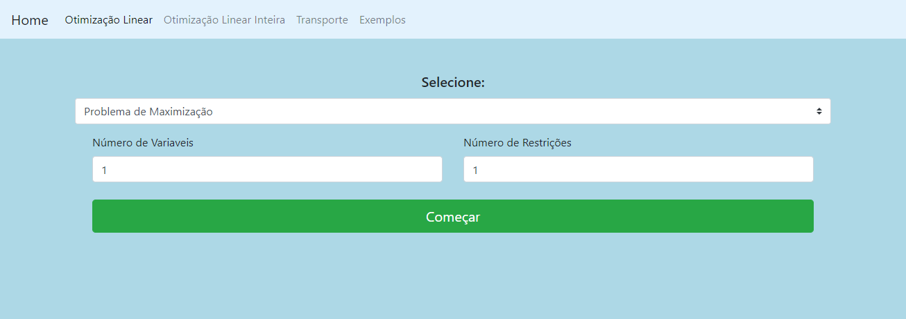

# Trabalho de Pesquisa Operacional I

  

 

[![Javascript][Javascript.com]][Javascript]

## Sobre o projeto 

Este é um trabalho desenvolvido na matéria de Pesquisa Operacional I
do 4º termo do curso de Bacharel em Ciência da Computação (BCC) da
UNESP "Julio de Mesquita Filho" do campus de Bauru, ministrada pelo professor Marco Antônio Rahal Sacoman.

O objetivo do projeto é disponibilizar alguns métodos de Programação Linear

> O projeto não foi finalizado!

## 💻 Pré-requisitos

Pra rodar o projeto na máquina é possível utilizar: 

- Extensão do vscode [Live Server](https://marketplace.visualstudio.com/items?itemName=ritwickdey.LiveServer)
- Tendo node.js na máquina versão superior a 14 e rodar `npx lite-server`

[Javascript.com]: https://img.shields.io/badge/Javascript-Code?style=for-the-badge&logo=javascript&logoColor=yellow&color=white
[Javascript]: https://developer.mozilla.org/pt-BR/docs/Web/JavaScript

[Javascript.com]: https://img.shields.io/badge/Javascript-Code?style=for-the-badge&logo=javascript&logoColor=yellow&color=white
[Javascript]: https://developer.mozilla.org/pt-BR/docs/Web/JavaScript